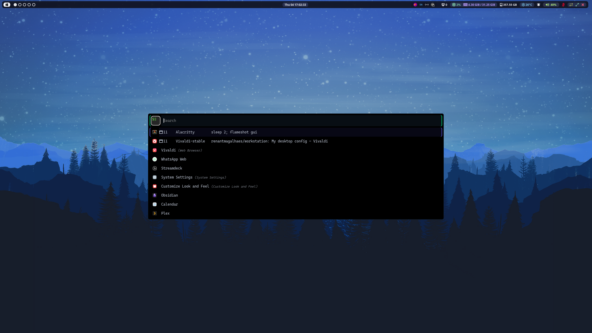
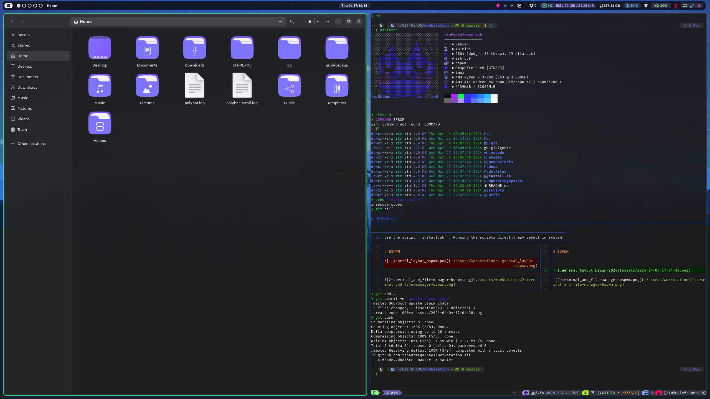
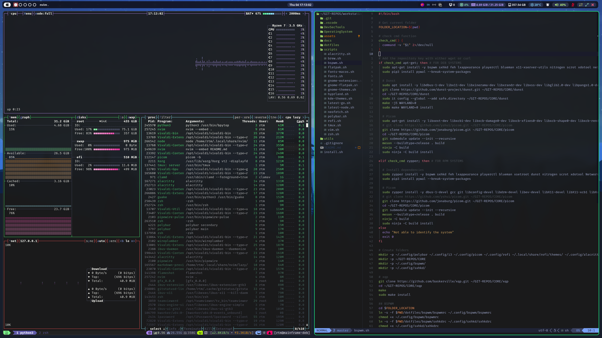
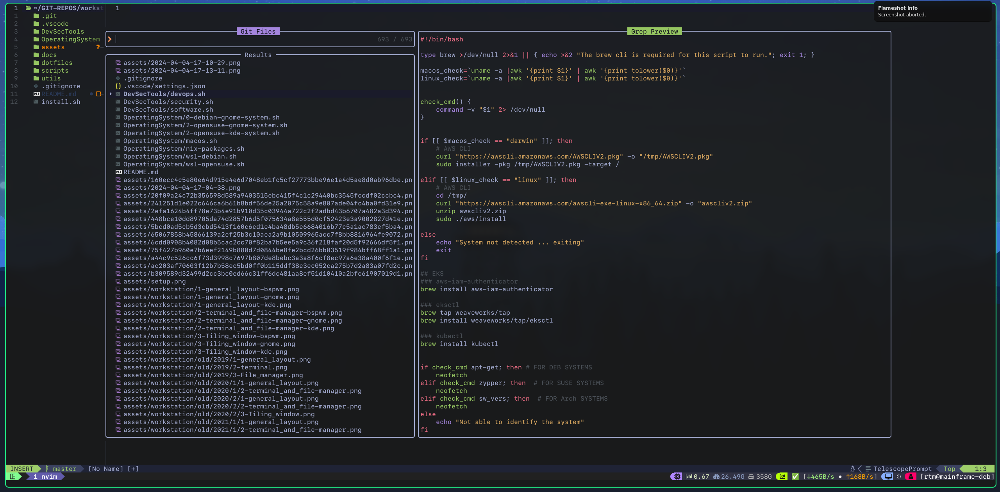
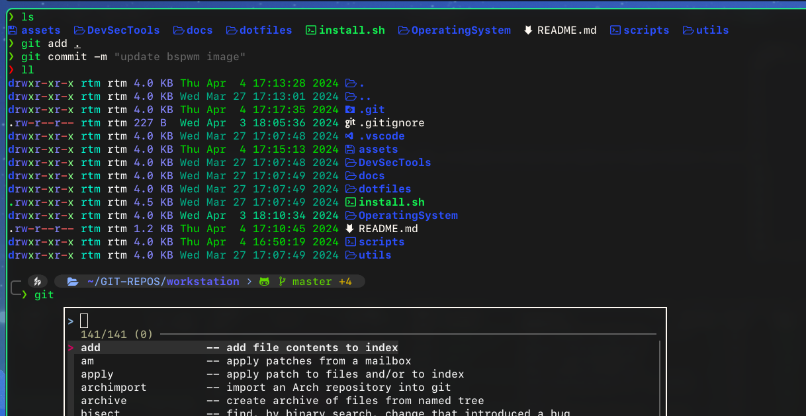
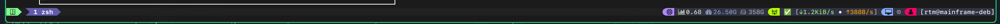
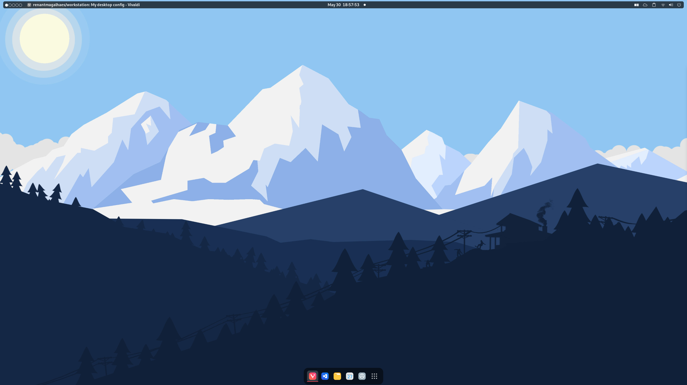
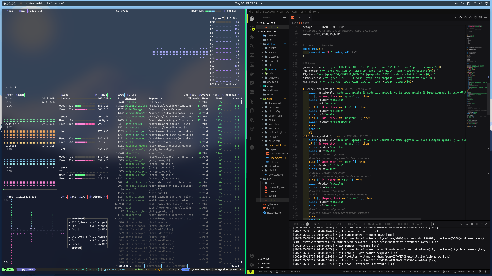

# workstation

```My full desktop environment.```


For:

- Debian 12 (BSPWM/Gnome)
- openSUSE Tumbleweed (BSPWM/Gnome)

### Disclaimer

Use the script ``install.sh``. Running the scripts directly may result in system malfunction.

# TODO

- [ ] Hyprland setup

# BSPWM - Current version

### Menu



### Workflow





### NeoVIM



### Terminal



### Tmux



# GNOME Version 4X.X






# KDE Plasma 5.2X - Retired


# RTM
