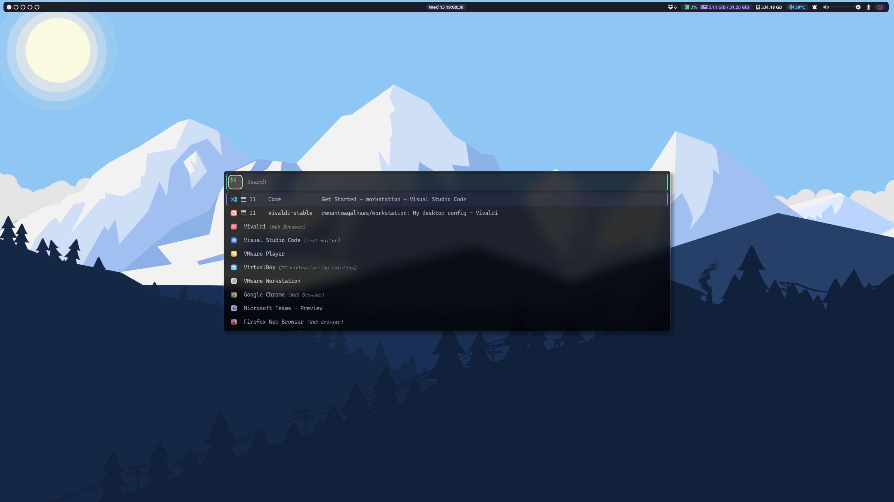
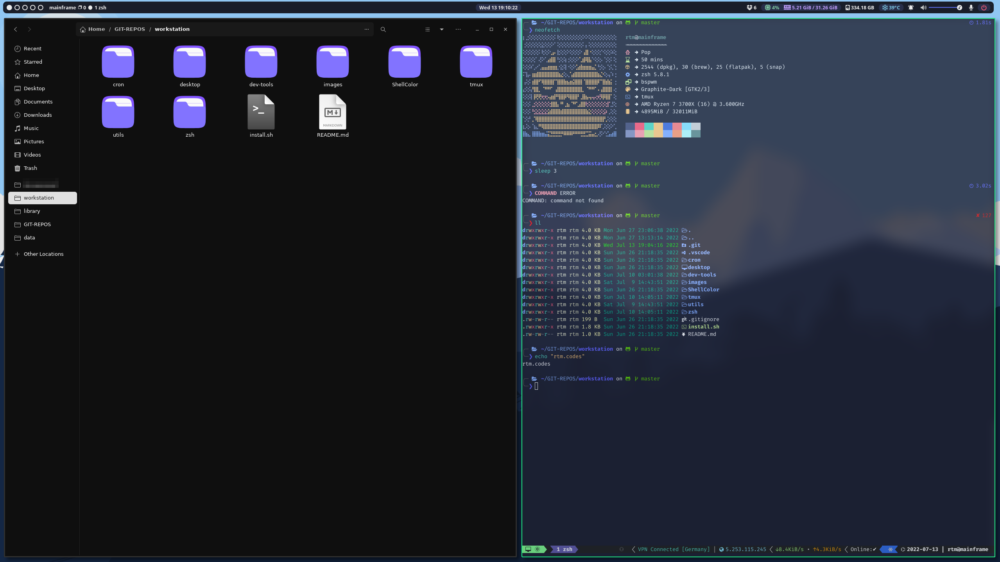
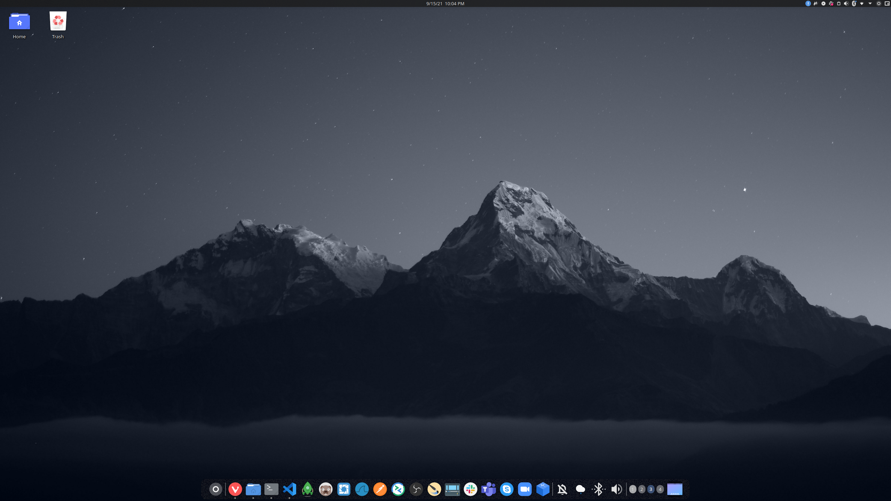
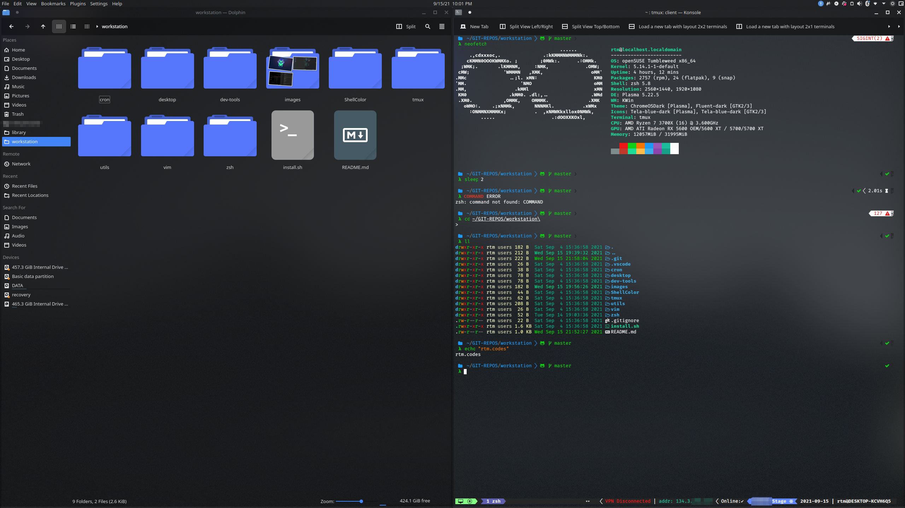
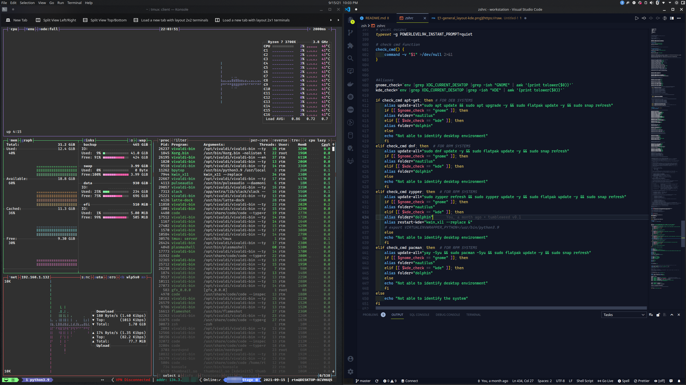
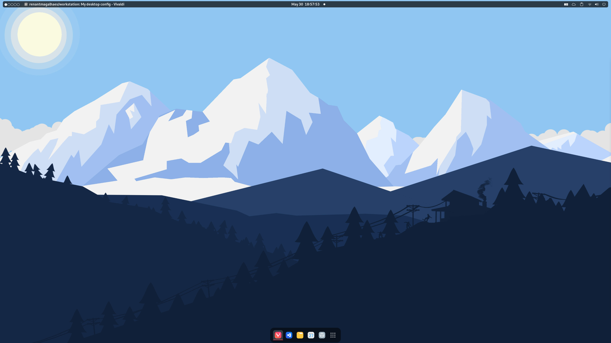
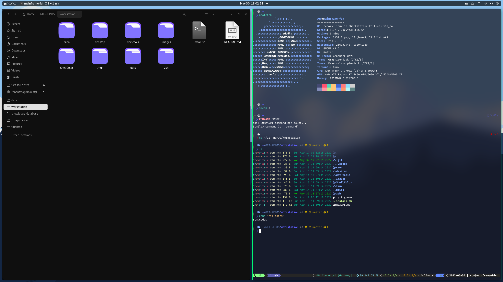
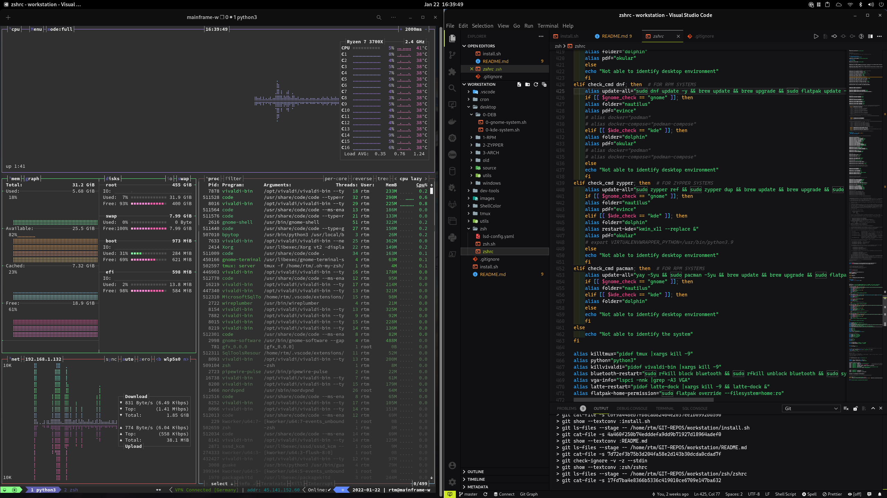

# workstation
```My full desktop environment.```

### Disclaimer !
Use the script ``install.sh``. Running the scripts directly may result in system malfunction. 

# BSPWM






# KDE Plasma 5.2X





 

# GNOME Version 41.X





