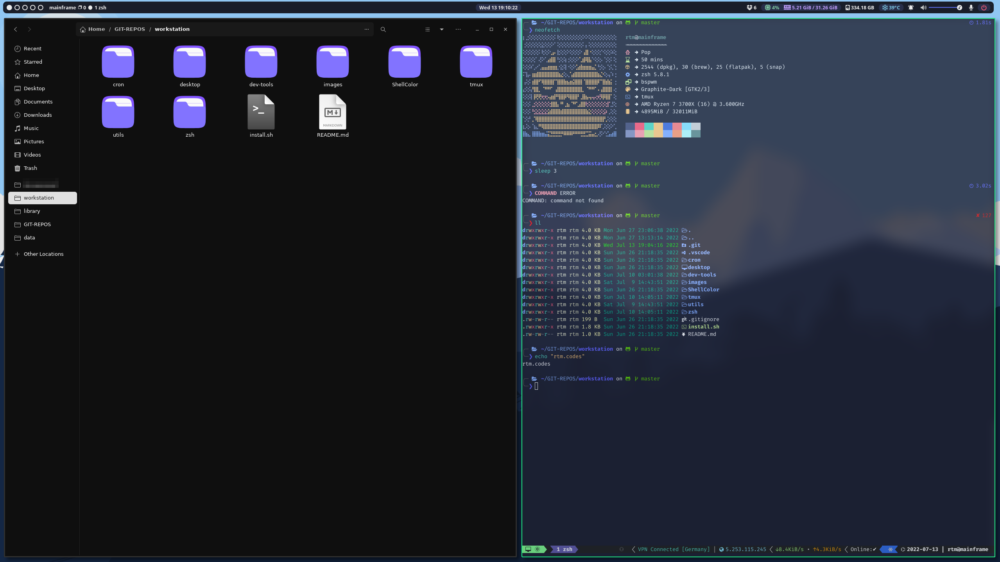
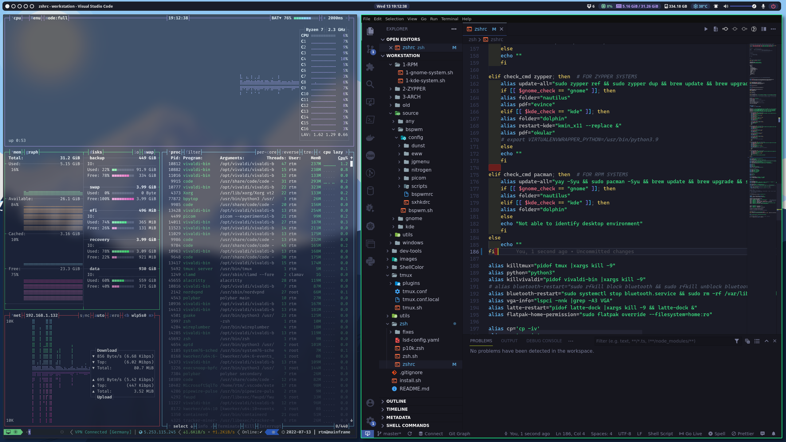
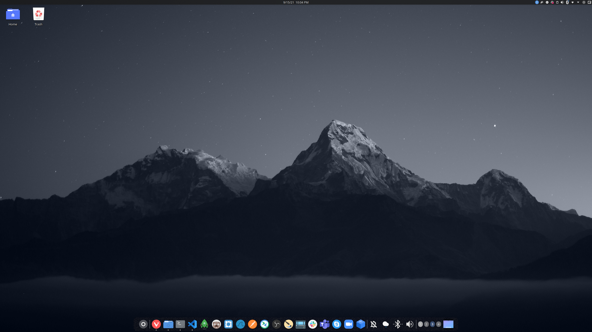
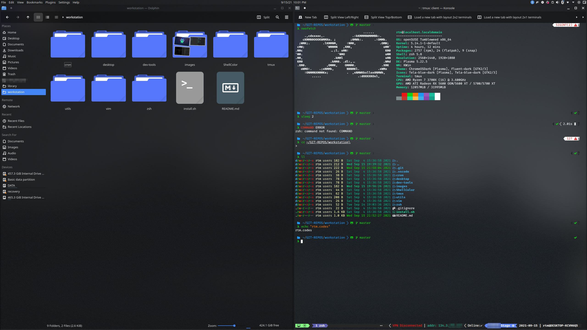
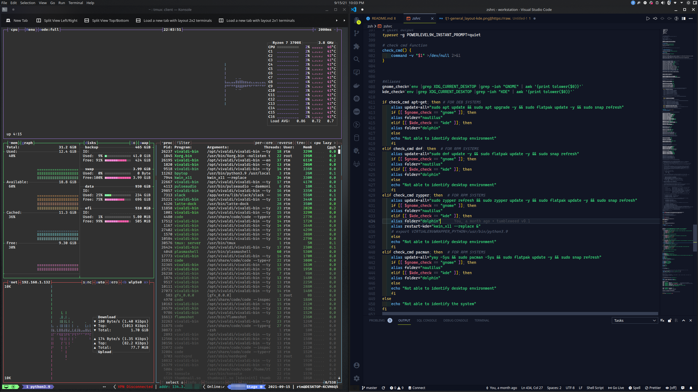
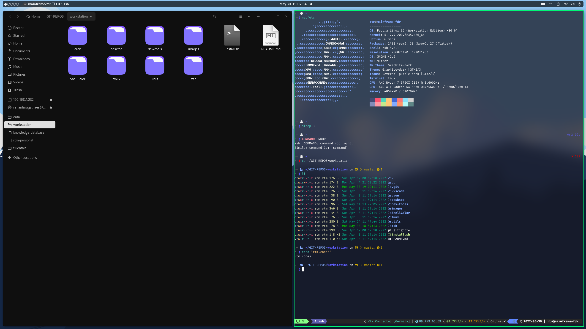
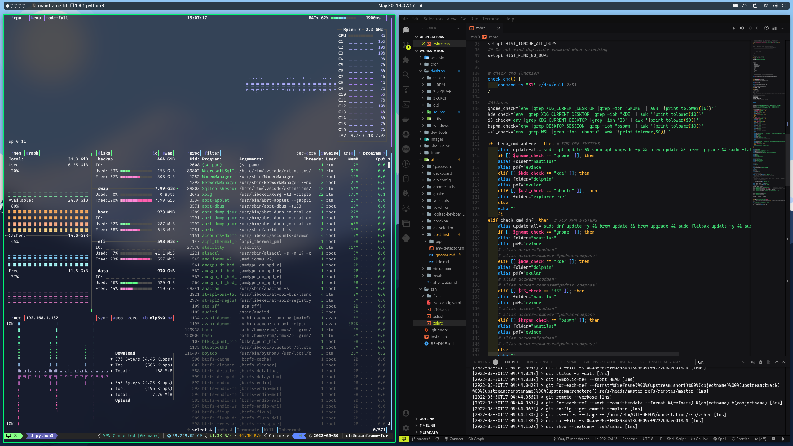

# workstation
```My full desktop environment.```

### Disclaimer !
Use the script ``install.sh``. Running the scripts directly may result in system malfunction. 

# TODO


- [] Make nix and zsh auto reload and join option 1, 2 , 3, 4 and 5 of the script
- [] Fix brew installation to be non-interactive.
- [] Fix font installation to be non-interactive.
- [] Fix themes installation to be non-interactive.
# BSPWM





# KDE Plasma 5.2X





 

# GNOME Version 41.X





