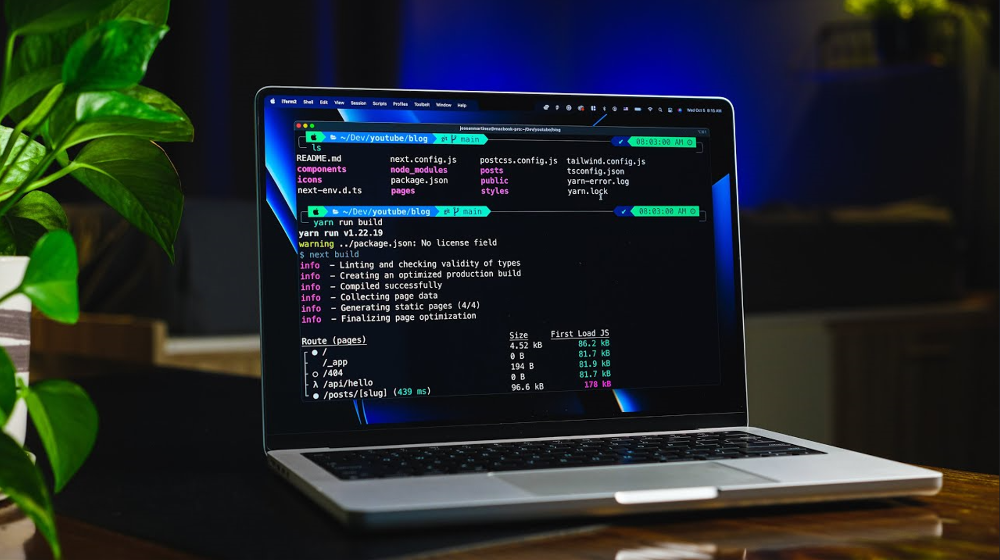
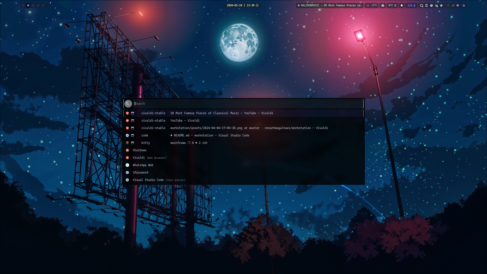
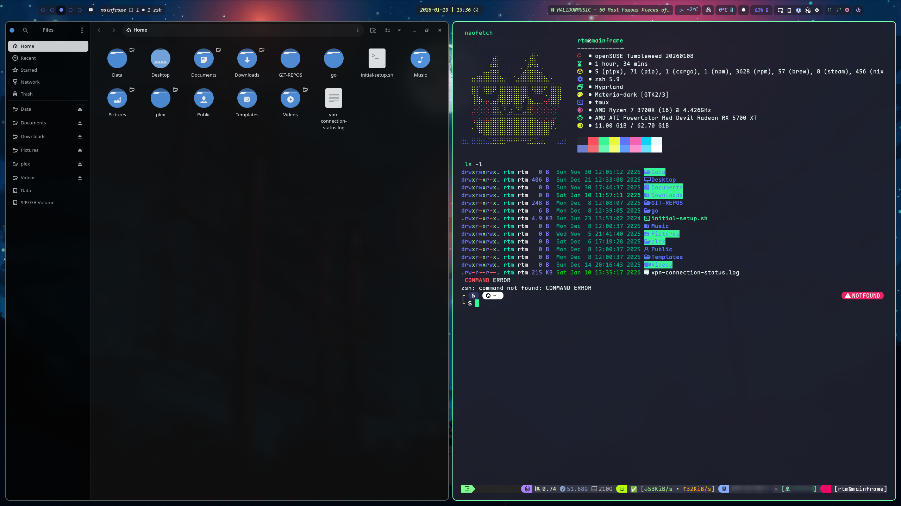
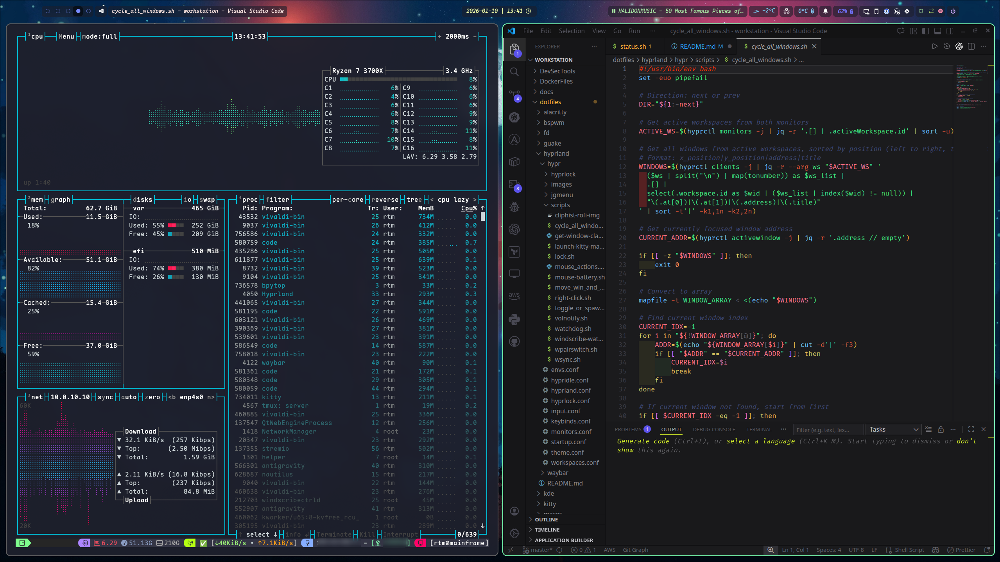

# workstation

`My full desktop environment.`

For:

- Debian 12 (BSPWM/Gnome)
- openSUSE Tumbleweed (BSPWM/Gnome)

### Disclaimer

Use the script `install.sh`. Running the scripts directly may result in system malfunction.

# TODO

- [ ] Better menu and window handling
- [ ] Automatic color scheme based on wallpaper
- [ ] Gnome-like overview
- [ ] Shortcuts preview
- [ ] Lock screen customization
- [ ] Notification Center
- [ ] Clipboard Manager

# HYPRLAND

### Menu

### Workflow

### NeoVIM

# RTM
