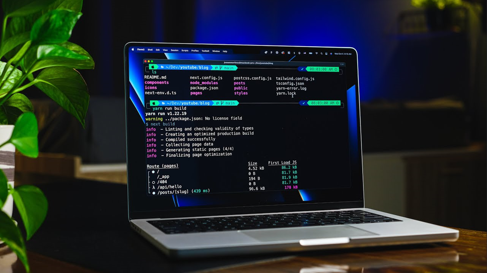
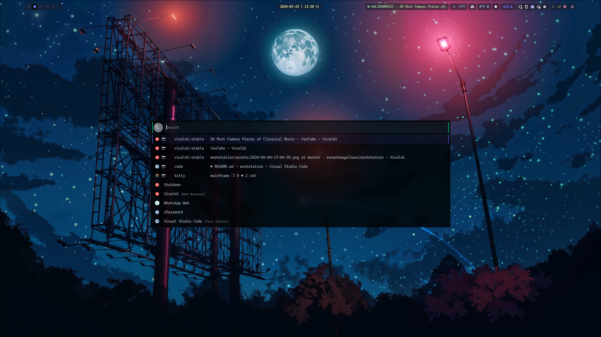
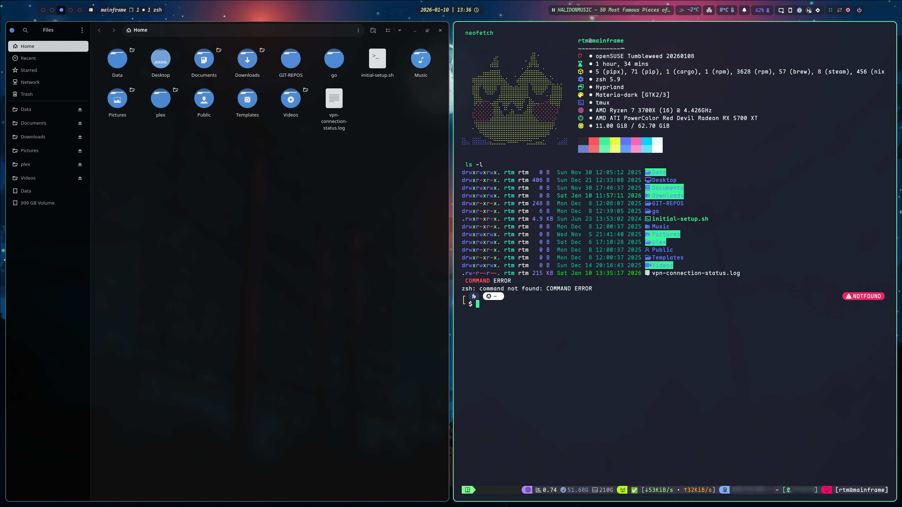
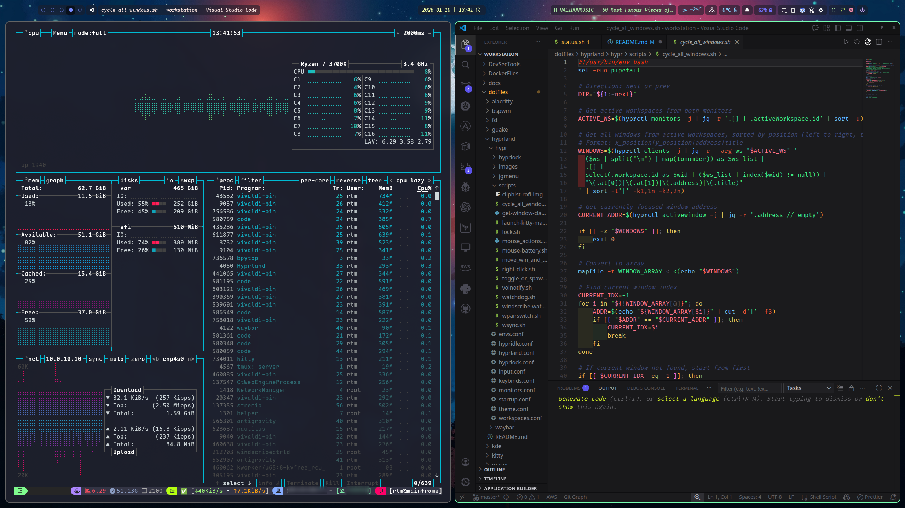
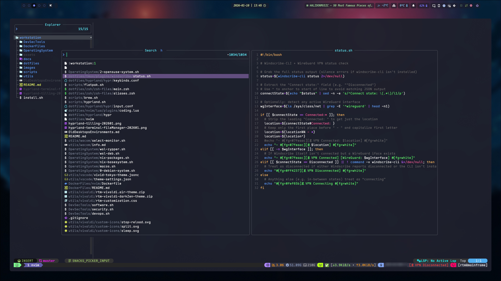

# workstation

`My full desktop environment.`

For:

- openSUSE Tumbleweed (_MangoWM_/Hyprland/Gnome)
- Debian 13 (_MangoWM_/Gnome)

### Disclaimer

Use the script `install.sh`. Running the scripts directly may result in system malfunction.

# TODO

- [ ] Gnome-like overview for hyprland
- [ ] Notification Center
- [ ] Clipboard Manager improvements (Quickshell?)
- [ ] Paperwm setup for Gnome (Scrolling layout)

# MangoWM

### Menu

### Workflow

### NeoVIM

# RTM
