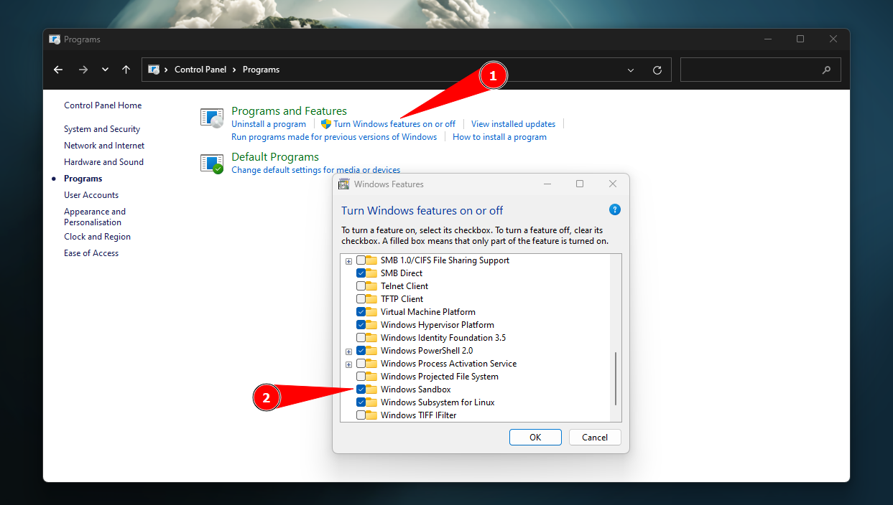

# Installation

# WSL2

```
wsl --install
wsl --update
wsl --set-default-version 2
```

Or Download via Microsoft Store (recommended)

# Microsoft Store

1. [Windows Terminal](https://apps.microsoft.com/store/detail/windows-terminal/9N0DX20HK701?hl=en-us&gl=us)
2. [Microsoft PowerToys](https://apps.microsoft.com/store/detail/microsoft-powertoys/XP89DCGQ3K6VLD?hl=en-us&gl=us)
3. [Visual Studio Code](https://apps.microsoft.com/store/detail/visual-studio-code/XP9KHM4BK9FZ7Q?hl=en-us&gl=us)
4. [oh-my-posh](https://apps.microsoft.com/store/detail/ohmyposh/XP8K0HKJFRXGCK)


# Customization

1. [Explorer Patcher](https://github.com/valinet/ExplorerPatcher)
2. [Rounded TB](https://apps.microsoft.com/store/detail/9MTFTXSJ9M7F?hl=en-us&gl=US)
3. [TranslucentTB](https://apps.microsoft.com/detail/9PF4KZ2VN4W9?hl=en-us&gl=US)
4. 
# Phone Sync
<!-- [Intel Unison - Windows](https://apps.microsoft.com/store/detail/intel%C2%AE-unison%E2%84%A2/9PP9GZM2GN26?hl=en-us&gl=us)
[Intel Unison - Android](https://play.google.com/store/apps/details?id=com.intel.mde&gl=US) -->
1. [Phone Link (Windows)](https://apps.microsoft.com/store/detail/phone-link/9NMPJ99VJBWV)
2. [Link to Windows(Android)](https://play.google.com/web/store/apps/details?id=com.microsoft.appmanager&hl=en_AU&gl=US&pli=1)

# Deboat Windows

Run `irm christitus.com/win | iex` from Administrator Terminal (Powershell)

Full documentation can be hound [**here**](https://christitus.com/windows-11-perfect-install/).
# Programs

1. [Python3](https://www.python.org/downloads/)
2. [winXcorners](https://github.com/vhanla/winxcorners/releases)
3. [WinDirStart](https://windirstat.net/download.html)
4. [Flameshot](https://github.com/flameshot-org/flameshot/releases/latest)
5. [Robo3t](https://robomongo.org/download)
6. [DBeaver](https://dbeaver.io/download/)
7. [pgAdmin](https://www.pgadmin.org/download/pgadmin-4-windows/)
8. [Lens](https://k8slens.dev)
9. [Wireshark](https://www.wireshark.org/#download)
10. [OBS Studio](https://obsproject.com/download)
11. [VirtualBox](https://www.virtualbox.org/wiki/Downloads)
12. [Genymotion](https://www.genymotion.com/download/)
13. [Vivaldi](https://vivaldi.com)
14. [Patchmypc](https://patchmypc.com/home-updater)
15. [Postman](https://www.postman.com/downloads/)
16. [AHK](https://www.autohotkey.com)
17. [1Password](https://1password.com/downloads/windows/)
18. [Plex](https://www.plex.tv/media-server-downloads/#plex-app)
19. [Logitech G HUB](https://www.logitechg.com/en-us/innovation/g-hub.html)
20. [NordVPN](https://nordvpn.com/download/windows/)
21. [MiniTool Partition Wizard](https://www.partitionwizard.com/download.html)
22. [PC Manager - CCleaner alternative](https://pcmanager-en.microsoft.com/)
23. [DaVinci Resolve](https://www.blackmagicdesign.com/products/davinciresolve)
24. [Elgato Stream Deck MK.2](https://www.elgato.com/en/downloads)
25. [Avermedia WebCam](https://www.avermedia.com/en/product-detail/PW513#download)
26. [HWiNFO64](https://www.hwinfo.com/download/)
27. [WACOM CTL-4100WL](https://www.wacom.com/en-us/support/product-support/drivers)
28. [Microsoft Whiteboard](https://www.microsoft.com/store/apps/9mspc6mp8fm4)
29. [Excalidraw](https://excalidraw.com/)
30. [Xmind](https://xmind.app/download/)

## Ninite
[Ninite](https://ninite.com)

- Chrome
- VLC
- K-Lite Codecs
- Java
- .NET
- Foxit Reader
- FileZilla
- Notepad++
- PuTTY
- 7-Zip

# Developer Tools

1. [Docker](https://www.docker.com/products/docker-desktop) - May not be needed with WSL2
2. [Chocolatey](https://chocolatey.org/install)
   1. Open PowerShell as Admin
   2. Run **Set-ExecutionPolicy AllSigned**
   3. ``` Set-ExecutionPolicy Bypass -Scope Process -Force; [System.Net.ServicePointManager]::SecurityProtocol = [System.Net.ServicePointManager]::SecurityProtocol -bor 3072; iex ((New-Object System.Net.WebClient).DownloadString('https://community.chocolatey.org/install.ps1')) ```
3. [AWS CLI](https://awscli.amazonaws.com/AWSCLIV2.msi)
4. [Git for Windows](https://gitforwindows.org)


## Choco

1. choco install -y openssh
2. choco install -y aws-iam-authenticator

## Kubernetes

1. kubectl
   1. Create new folder under **C:\bin**
   2. Download binary inside the folder 
      1. curl -o kubectl.exe https://amazon-eks.s3.us-west-2.amazonaws.com/1.21.2/2021-07-05/bin/windows/amd64/kubectl.exe
   3. Add **C:\bin** on Windows PATH
      1.  System > Advanced system settings > Advanced > Environment Variables > Path > Edit > New > C:\bin > > Ok

## Sandbox

Add windows sandbox environment

1. Control Panel
2. Programs and Features
   1. Turn Windows features on or off
   2. Enable sandbox and restart computer



## Windows11

1. Start11