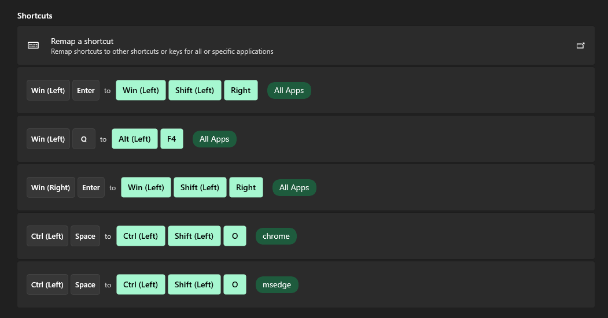
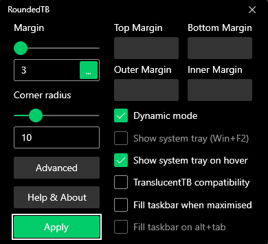

# Windows

Theme > Dark Bloon
Taskbar > Disable Show my taskbar on all displays

# Power Toys
## Keyboard Manager


# Windows SO

## Personalization

1. Personalization
   1. Colors -> Turf Green
   2. Transparency effects -> ON
   3. Show accent colour on title bars and windows borders -> ON

## PowerToys

### Run

- Activation key -> Alt + Space
- Number of results shown before scrolling -> 5
- Window Walker
  -  Score modifier -> 1000

[Copy scripts from this folder](./scripts/) to `%APPDATA%\Microsoft\Windows\Start Menu\Programs\Startup` or `shell:startup`
### Quick Accent

- Enable IT!!

### Keyboard Manager (DEPRECATED)

  


# Windows Terminal

## Startup

- Create a shortcut and send to `shell:startup` with Minimized option selected

  


Default profile -> Ubuntu
Default Terminal application -> Windows Terminal

### Interaction

[Copy this JSON to terminal](./config/wsl-terminal/settings.json) or follow:

Enable Automatically copy selection to clipboard

- Appearance

Theme -> Dark

## Actions

1. + Add New
2. Summon Quake window
3. Set ctrl+enter
## **Profiles**

### Azure

General -> Hide profile from dropdown (enable)

### Ubuntu

General

Starting directory

```
\\wsl.localhost\Ubuntu\home\rtm
```

Appearance

Color scheme > One Half Dark
Font Face > FuraCode Nerd Font Retina

Enable Acrylic
Opacity -> 90%

Advanced

Disable all Bell notification

# Fix alt-tab

System -> Multitasking -> Show Microsoft Edge tabs when snapping or pressing Alt + Tab -> Don't show tabs
# Start11

## Start Menu

- Windows 11 Style

## Taskbar

Taskbarsize > Small

## Control

Set all to Windows Menu

# Stream Deck

- CPU
- Battery
- Weather
- Win Tools
- Speed Test
- OBS Tools
- IFTTT
- Visual Studio Code
- HWiNFO64
  - [Config file to import](./config/hwinfo/HWiNFO64_settings.reg)

# Rounded TB

  
