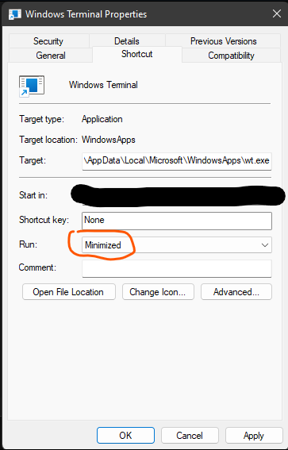

# Windows

Theme > Dark Bloon
Taskbar > Disable Show my taskbar on all displays

# Power Toys
## Keyboard Manager

```
Win(Left) + Enter -> Win(Left) + Shift(Left) + Right Arrow Key
```

# Windows SO

## Personalization

1. Personalization
   1. Colors
   2. Transparency effects -> ON
   3. Show accent colour on title bars and windows borders -> ON

## PowerToys

### Run

- Activation key -> Alt + Space
- Number of results shown before scrolling -> 5
- Window Walker
  -  Score modifier -> 1000

[Copy this](./scripts/0-rtm-shortkeys.ahk) to `%APPDATA%\Microsoft\Windows\Start Menu\Programs\Startup` or `shell:startup`
### Quick Accent

- Enable IT!!

### Keyboard Manager

```
Win(left) + enter -> Win(left) + Shift(left) + Right arrow key
Win(left) + Q -> Alt(left) + F4
```
# Windows Terminal

## Startup

- Create a shortcut and send to `shell:startup` with Minimized option selected

  


Default profile -> Ubuntu
Default Terminal application -> Windows Terminal

### Interaction

Enable Automatically copy selection to clipboard

- Appearance

Theme -> Dark

## Actions

1. + Add New
2. Summon Quake window
3. Set ctrl+enter
## **Profiles**

### Azure

General -> Hide profile from dropdown (enable)

### Ubuntu

General

Starting directory

```
\\wsl.localhost\Ubuntu\home\rtm
```

Appearance

Color scheme > One Half Dark
Font Face > FuraCode Nerd Font Retina

Enable Acrylic
Opacity -> 90%

Advanced

Disable all Bell notification

# Start11

## Start Menu

- Windows 11 Style

## Taskbar

Taskbarsize > Small

## Control

Set all to Windows Menu