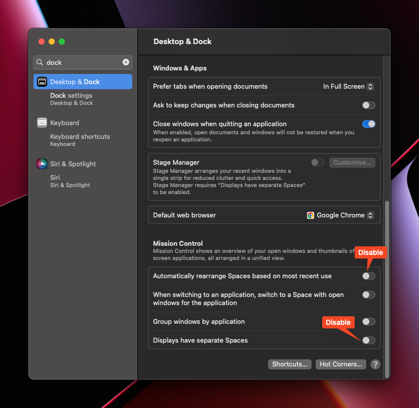
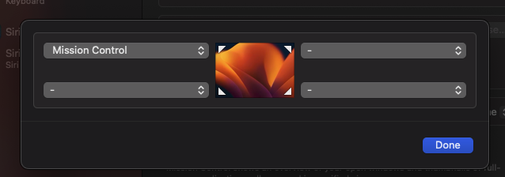
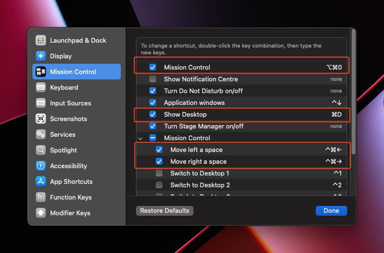
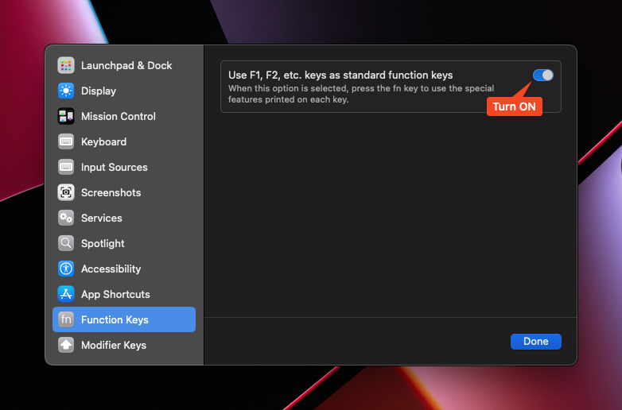

# Apps

## Free

- [VSCode](https://code.visualstudio.com/docs?dv=osx)
- [Warp](https://www.warp.dev) - Terminal
- [Docker](https://docs.docker.com/desktop/install/mac-install/)
- [Colima](https://github.com/abiosoft/colima) - Container runtimes on macOS
- [Raycast](https://www.raycast.com) - Spotlight alternative
- [Shottr](https://shottr.cc) - Screenshot annotation tool powered by AI
- [Xnip](https://www.xnipapp.com) - Another nice screenschot tool
- [Hidden bar](https://apps.apple.com/de/app/hidden-bar/id1452453066?mt=12) - Hide top icons from macos bar
- [Hand Mirror](https://apps.apple.com/us/app/hand-mirror/id1502839586?mt=12) - Get a mirror on top bar
- [Karabiner](https://karabiner-elements.pqrs.org) - Remap MacOS keybinds
- [IINA](https://iina.io) - Video Player
- [xMind](https://www.xmind.app/go/appstore/xmind-mac?ct=OfficialWebsite) - Mind Map
- [Rectangle](https://rectangleapp.com/) - Windows Resizing
- [Caffeine](https://www.macupdate.com/app/mac/24120/caffeine)
- [TopNotch](https://topnotch.app) - Remove Notch / Change menu bar color
- [HotKey App](https://apps.apple.com/us/app/hotkey-app/id975890633?mt=12) - Define keyboard shortcuts to launch Applications or to open folders in Finder.
# Testing phase

- [Amethyst](https://ianyh.com/amethyst/) - Tilling Window Manager
- only-switch - Crash on ventura

# Try in the future

- [Sketchy Bar](https://github.com/FelixKratz/SketchyBar)

# Bar layout
  

# Settings

  

# Hot corners
  

# Keyboard Shortcurts

## System
  

  

## Karabiner
[Complex Modifications](./config/karabiner.json)

# Discontinued Apps
- [CopyClip](https://apps.apple.com/us/app/copyclip-clipboard-history/id595191960?mt=12) - Replaced by Maccy
