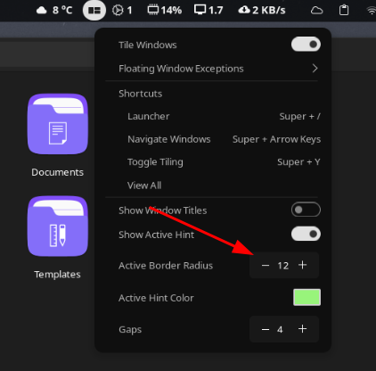

# GNOME

- Sync extensions


- List of extensions

```
scroll-workspaces@gfxmonk.net          
Vitals@CoreCoding.com                                       
user-theme@gnome-shell-extensions.gcampax.github.com
openweather-extension@jenslody.de                 
workspace-indicator@gnome-shell-extensions.gcampax.github.com
SimplerOffMenu.kerkus@pm.me                         
windowoverlay-icons@sustmidown.centrum.cz
extensions-sync@elhan.io                 
desktop-scroller@brorlandi                                   
cpupower@mko-sl.de
arcmenu@arcmenu.com                                                   
sound-output-device-chooser@kgshank.net
remove-alt-tab-delay@daase.net
noannoyance@daase.net
status-area-horizontal-spacing@mathematical.coffee.gmail.com
unite@hardpixel.eu
blur-my-shell@aunetx
gsconnect@andyholmes.github.io
bluetooth-quick-connect@bjarosze.gmail.com
appindicatorsupport@rgcjonas.gmail.com
dash-to-panel@jderose9.github.com
transparent-shell@siroj42.github.io
just-perfection-desktop@just-perfection
```

# PopShell

- Install on Fedora

```shell
sudo dnf install gnome-shell-extension-pop-shell --exclude=gnome-shell-extension-pop-shell-shortcut-overrides
```

- Add border radius
```
sudo vi /usr/share/gnome-shell/extensions/pop-shell@system76.com/dark.css
sudo vi /usr/share/gnome-shell/extensions/pop-shell@system76.com/dark.css 
```

- Replace the first 6 lines with 

```
.pop-shell-active-hint {
    border-style: solid;
    border-color: #FBB86C;
    border-radius: 12px;
    box-shadow: inset 0 0 0 1px rgba(24, 23, 23, 0)
}
```

- Restart the PC and change the radius in the configuration

  

## Theme edit

### Fluent-dark
~/.themes/Fluent-dark/gnome-shell/gnome-shell.css

```
/* Top Bar */
#panel {
  font-weight: bold;
  font-size: 11pt;
  font-feature-settings: "tnum";
  transition-duration: 250ms;
  background-color: #202020;
  border-radius: 6px;
  margin-top: 5px;
  margin-bottom: 5px;
  margin-left: 12px;
  margin-right: 12px;
  height: 38px;
}

#panel #panelLeft, #panel #panelCenter {
  spacing: 0;
}

#panel .panel-corner {
  -panel-corner-radius: 0;
  -panel-corner-background-color: #202020;
  -panel-corner-border-width: 0;
  -panel-corner-border-color: transparent;
  -panel-corner-opacity: 0;
  transition-duration: 250ms;
}

#panel .panel-button {
  -natural-hpadding: 8px;
  -minimum-hpadding: 4px;
  font-weight: bold;
  color: rgba(255, 255, 255, 0.945)
  transition-duration: 150ms;
  text-shadow: none;
  border: none;
  border-radius: 0;
}
```


### Graphite-dark

~/.themes/Graphite-dark/gnome-shell/gnome-shell.css

#### Gaps panel

Need to remove the `/* Top Bar */` header to work

```
#panel{
  background-color: transparent;
  margin: 3px;
  height: 32px;
}
.workspace-animation{ background-color: #272727; }
.panel-button,
.clock,
.clock-display StIcon{
color: #ffffff;
  border-radius: 14px;
  border: 3px solid transparent;
  background-color: #131313;
  box-shadow: inset 0 0 0 1px rgba(255, 255, 255, 0.03);
}
```


#### Floating panel
```
/* Top Bar */
#panel {
  /* background-color: black; */
  background-color: rgba(0,0,0,0.9);
  font-weight: bold;
  height: 32px;
  color: rgba(255, 255, 255, 0.7);
  font-feature-settings: "tnum";
  transition-duration: 250ms;
  font-size: 11pt;
  border-radius: 6px;
  margin-top: 5px;
  margin-bottom: 5px;
  margin-left: 12px;
  margin-right: 12px;
}


#panel .panel-corner {
  -panel-corner-radius: 0;
  -panel-corner-background-color: black;
  -panel-corner-border-width: 2px;
  -panel-corner-border-color: transparent;
  -panel-corner-opacity: 1;
  transition-duration: 250ms;
}

#panel .panel-button {
  -natural-hpadding: 12px;
  -minimum-hpadding: 6px;
  font-weight: bold;
  color: rgba(255, 255, 255, 0.945);
  transition-duration: 150ms;
  border-radius: 9999px;
  text-shadow: none;
  border: 2px solid transparent;
}
```