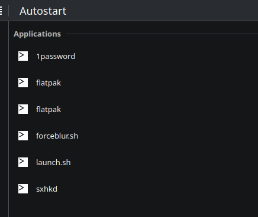

# KDE

# Themes

# System Settings

- Application Style
  - Configure GNOME/GTK
- Desktop effects
  - Overview (assign shortcut if necessary)
  - Enable Blur
  - Dim Screen for Administrator Mode
  - Slide Back
  - Enable Magic Lamp
    - Animation 170ms
      <!-- - Enable Wobby Windows -->
        <!-- - Uncheck Wobbly when resizing. -->
- Task Switcher
  - Thumbnail Grid
- Virtual Desktops
  - Let only 1 row
    - add 5 desktops
  - Disable Navigation Wraps Around
  - Top left corner
    - Overview
- Desktop Session
  - Start with an empty session
- General Behaviour (double click)
  - Clicking files or folders:
    - Selects them
- Left Click on desktop -> Configure Desktop and Wallpaper
  - Wallpaper Type -> GetNEw Plugins -> Inactive Blur
    - Blur by 40% over 400ms
- Left Click on desktop -> Configure Desktop and Wallpaper
  - Wallpaper Type -> GetNEw Plugins -> Smart Video Wallpaper
    - <https://mylivewallpapers.com>
    - <https://www.pexels.com/videos/>
    - <https://pixabay.com/videos/search/live%20wallpaper/>

## KWin Scripts

- Force Blur
- Window Gaps (bismuth)
- Hide all title bars (window rules)
  

## Extra

- AutoStart



```
flatpak run com.core447.StreamController

flatpak run com.github.hluk.copyq

/home/rtm/.dotfiles/kde/forceblur.sh
```

### Widgets

- Command Output
  - ~/.dotfiles/kde/widgets/workspace.sh
  - ~/.dotfiles/kde/widgets/active_window_icon.sh

### Window tilling setup

#### Krohnkite

Kwin Scripts -> Enable Krohnkite

##### Window rules

- Ignore Windows "By Class"

```
krunner,yakuake,spectacle,kded5,xwaylandvideobridge,plasmashell,ksplashqml,org.kde.plasmashell,org.kde.polkit-kde-authentication-agent-1,org.kde.kruler,kruler,kwin_wayland,ksmserver-logout-greeter,Guake,guake,copyq
```

- Float Windows "By title"

```
kitty-tdrop
```

Geometry

```
15px across all 5 zones
Bottom 20px
```

#### Klassy

Window Decorations -> Klassy

Klassy settings -> Adjust as needed

#### KDE BAR (botton configuration)


- Left panel

  - [Chaac Weather](https://github.com/zayronxio/Chaac-Complete-Weather)
    - Visit [Open-Meteo](https://open-meteo.com/en/docs?latitude=40.2183) docs to find coordinates
  - Command output (change $CITYNAME)
    - `curl -s 'wttr.in/CITYNAME?format=3&M' | cut -d':' -f2-`
    - Run every: 900000 ms
  - Media player
  - [Kara](https://github.com/dhruv8sh/kara/)

- Central panel

  - [Andromeda Launcher](https://github.com/EliverLara/AndromedaLauncher)
  - Icon-only task manager

- Right panel
  - System tray
  - Digital clock
    - Roboto Bold font
