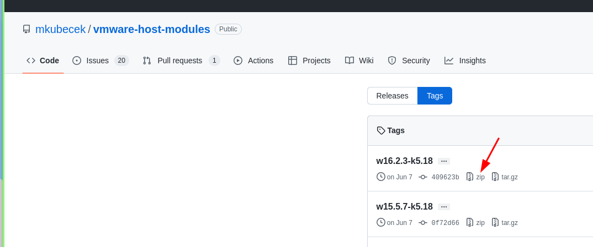

# VMMON and VMNET installation

1. https://github.com/mkubecek/vmware-host-modules
2. Download host modules
  
3. ```unzip file && cd file```
4. ```tar -cf vmmon.tar vmmon-only && tar -cf vmnet.tar vmnet-only```
5. ```sudo cp -v vmmon.tar vmnet.tar /usr/lib/vmware/modules/source/```
6. ```sudo vmware-modconfig --console --install-all```

